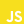
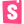

<!--
  minh1904 — GitHub profile README
  ────────────────────────────────
  Design source: Figma artboard "README · Light" (file Untitled, next to Wireframe - 1).

  Everything dynamic is rendered by GitHub Actions into static files in this repo:
    · assets/activity.svg   ← scripts/gen-activity.js  (workflow: Activity stats)
    · assets/icons/*.svg    ← scripts/gen-stack.js     (run by hand; also rewrites the block below)
    · branch `output`       ← Platane/snk              (workflow: Contribution snake)
  No third-party card services are embedded, so nothing breaks on rate limits.

  Edit by hand: the Selected work section (currently "coming soon") and the Elsewhere links.
-->

I build interfaces with React and TypeScript. Two things pull at me equally: the creative
side — motion, canvas, the layout that has no business working — and design systems, which is
what turns the good ideas into something a whole team can ship twice.

## SELECTED WORK

**Coming soon** — cleaning up a few repos before they go public.

## STACK

<!-- stack:start -->

&nbsp;
&nbsp;
&nbsp;
&nbsp;
&nbsp;
&nbsp;
&nbsp;
&nbsp;
&nbsp;
&nbsp;
&nbsp;
&nbsp;
&nbsp;
&nbsp;
&nbsp;
&nbsp;
&nbsp;
&nbsp;
&nbsp;
&nbsp;
&nbsp;
&nbsp;
&nbsp;
&nbsp;
&nbsp;
&nbsp;
&nbsp;
&nbsp;
&nbsp;
&nbsp;

<!-- stack:end -->

## ACTIVITY

<picture>
  <source media="(prefers-color-scheme: dark)"  srcset="https://raw.githubusercontent.com/minh1904/minh1904/output/snake-dark.svg" />
  <source media="(prefers-color-scheme: light)" srcset="https://raw.githubusercontent.com/minh1904/minh1904/output/snake-light.svg" />
  
</picture>

## ELSEWHERE

[Portfolio ↗](https://github.com/minh1904)&nbsp;&nbsp;&nbsp;&nbsp;
[GitHub ↗](https://github.com/minh1904)&nbsp;&nbsp;&nbsp;&nbsp;
[LinkedIn ↗](https://www.linkedin.com/in/minh1904)&nbsp;&nbsp;&nbsp;&nbsp;
[Email ↗](mailto:110233275+minh1904@users.noreply.github.com)

 

